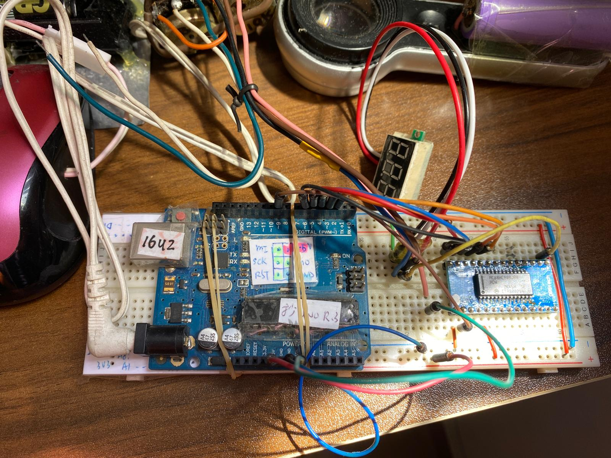
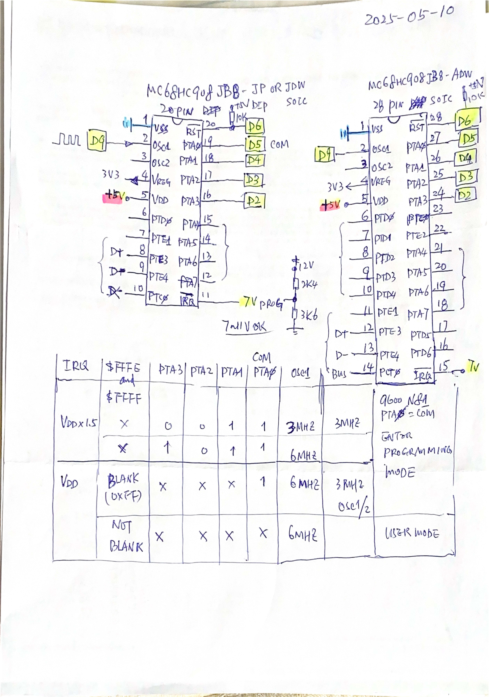

# xiaolaba testing, not working, did not know why.
  
  
  
  

# Using the Programmer.
- First, flash the Arduino programmer in firmware_arduino to an Arduino Uno / Duemilanove.
- Place a HC908 on a breadboard and wire it up as shown in the table in the **How it Works** section.
- Compile your HC908 firmware using SDCC to an S19 file (an example is in the firmware_hc908 folder).
- Compile the srecToProgrammer program using VisualStudio (I've used 2019 Community Edition).
- Run `srecToProgrammer <srec_file> <comport_index>` to send the data to HC908 via the Arduino.

# How it Works.
To enter Monitor Mode we need the following
Power the arduino from 12V for the high voltage with a voltage divider to generate 7 volts
From table 10-1 of the HC908 datasheet,

**HC908_PTA3=1**

**HC908_PTA2=0**

**HC908_PTA1=1**

**HC908_PTA0=1**

**HC908_OSC1=3MHz**

**HC908_RST=1**

**HC908_IRQ=7V**

Once monitor mode has been entered, PTA0 becomes both the TX and RX pin through which the Arduino and HC908 communicate.
With PTA3 set to zero, the communications baudrate will be slightly higher than 4800bps.

With some experimentation, the best clock obtainable was 3.125MHz. This means care needs to be taken with serial code as timings will be off a bit.
After experimentation, timings for bit durations were obtained  so the correct bit-rates can be used during programming.

### MC68HC908JB8-JP or JDW, 20pin DIP / SOIC

|Arduino	|HC908	|HC908	|Arduino|
| ---------:| ----- | -----:| ----- |
|	GND		|Vss 	|~RST	|D6 (10K pullup to Vdd)|
|	D9		|OSC1	|PTA0	|D5|
|			|OSC2	|PTA1	|D4|
|			|VReg	|PTA2	|D3|
|	+5V		|Vdd	|PTA3	|D2|
|			|PTD0	|PTA4||
|			|PTE1	|PTA5||
|			|PTE3	|PTA6||
|			|PTE4	|PTA7||
|			|PTC0	|~IRQ	|7V (via 2K4 - 3K6 divider between 12V and GND)|

